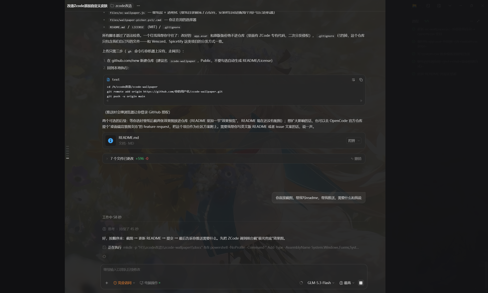
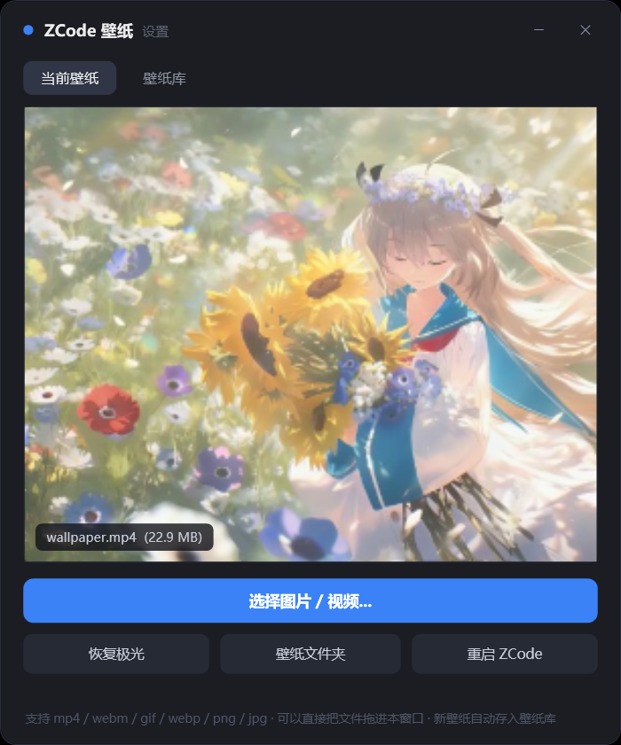

# zcode-wallpaper 🖼️

给 **ZCode Desktop**（OpenCode 系 AI 编程客户端）注入**动态壁纸背景**的社区补丁：

- 🎬 用**任意图片或视频**（mp4 / webm / gif / webp / png / jpg）作为整个界面的背景，视频静音循环播放
- 🌌 未设置壁纸时显示内置的**动态极光渐变**兜底
- 🪟 自动把界面面板改为半透明"玻璃"效果，弹窗保持高不透明度保证可读
- 🖱️ 现代 GUI 壁纸选择器（深色圆角界面、实时预览、拖拽导入）
- 📚 **壁纸库**：设置过的壁纸全部保留，缩略图网格管理，随时一键切回
- 🔄 **自动轮换**：勾选"打开 ZCode 时自动更换"后，每次打开 ZCode 自动换用库中勾选的下一张壁纸，重启进度不丢
- 🎛️ 所有透明度参数集中在壁纸目录下的 `custom.css`，改完重启即见，**无需重新打补丁**
- ↩️ 一键回滚：补丁自动备份原程序文件

> ⚠️ **本项目不分发 ZCode 程序本体**，只分发补丁脚本和我们自己编写的注入文件。安装时在你本机的程序上执行修改，原文件自动备份。

## 效果预览

视频壁纸 + 半透明界面（壁纸为用户自选的 mp4，静音循环播放）：



内置的 GUI 壁纸选择器：



## 效果

| 状态 | 说明 |
|---|---|
| 未设置壁纸 | 界面半透明 + 蓝紫极光渐变缓慢漂移 |
| 设置图片 | 图片铺满窗口（object-fit: cover）+ 可调暗色遮罩 |
| 设置视频 | 视频铺满窗口静音循环播放 |

补丁生效后，ZCode 窗口标题末尾会出现 **✦** 标记。

## 环境要求

- Windows 10/11
- ZCode Desktop 3.x（其他版本或 OpenCode 桌面端原理相同，注入点可能不同，见下方"工作原理"）
- Node.js（仅打补丁时需要，用到 `npx @electron/asar`；日常使用不需要）

## 安装

```powershell
# 在仓库目录下执行（ZCode 需处于关闭状态）
powershell -NoProfile -ExecutionPolicy Bypass -File .\apply-patch.ps1
```

脚本会自动：

1. 探测 ZCode 安装目录（也可用 `-InstallDir "D:\..."` 指定）
2. 备份 `resources\app.asar` → `resources\app.asar.zwp-backup`
3. 解包 → 注入壁纸脚本 → 重新打包并校验
4. 创建壁纸目录 `%USERPROFILE%\.zcode\wallpaper\`（含 `custom.css` 调参模板）
5. 在桌面和开始菜单创建「ZCode壁纸选择器」快捷方式

完成后启动 ZCode，看到标题 **✦** 即生效。

## 使用壁纸

- 双击桌面的 **ZCode壁纸选择器** → 选择图片 / 视频（或直接拖文件进窗口）→ 「重启 ZCode」生效
- 每张设置过的壁纸都会自动存入**壁纸库**（`%USERPROFILE%\.zcode\wallpaper\library\`）
- 「壁纸库」页签里可以：单击卡片应用为当前壁纸、勾选「轮换」、删除不要的

### 自动轮换

在「壁纸库」页签打开 **"打开 ZCode 时自动更换壁纸"** 开关，并勾选想参与轮换的壁纸。
之后**每次打开 ZCode**（无论手动启动还是从选择器重启）都会自动换用勾选壁纸中的下一张，
轮换进度保存在应用本地，重启、升级都不丢。关闭开关即固定为当前壁纸。

也可以手动把文件改名为 `wallpaper.扩展名` 放进 `%USERPROFILE%\.zcode\wallpaper\`（不经过库）。
多个文件同时存在时按 `mp4 → webm → gif → webp → png → jpg` 优先。

## 调整透明度

编辑 `%USERPROFILE%\.zcode\wallpaper\custom.css`（文件内有注释模板），保存后重启 ZCode。删除该文件即恢复默认值。

## 卸载 / 回滚

```powershell
powershell -NoProfile -ExecutionPolicy Bypass -File .\apply-patch.ps1 -Rollback
```

## 工作原理

ZCode Desktop 是 Electron 应用，界面打包在 `resources\app.asar` 中：

1. 解包 asar，得到 `out\renderer\index.html`（主窗口入口）
2. 在 index.html 的主 bundle `<script>` 之前插入一行 `<script src="./oc-wallpaper.js"></script>`
3. `oc-wallpaper.js` 在页面加载最早期：
   - 注入 CSS 把 Tailwind 语义变量（`--color-background`、`--color-panel`、`--color-sidebar` 等）覆盖为半透明值
   - 创建 `position:fixed; z-index:-1` 的壁纸层，探测壁纸文件（视频/图片元素方式加载，无跨域问题）
   - 没有壁纸文件时启用 CSS 动画极光兜底
4. 重新打包 asar 替换回去（`--unpack` 保持原生模块外置，打包后与原 `.unpacked` 目录清单比对校验）

Electron 的 asar 本质是一个打包格式，任何 Electron 应用的 HTML 入口都可以用同样的思路注入自定义 CSS/JS——欢迎参考改造其他应用。

## 已知限制

- ZCode **升级后补丁会被覆盖**，需要重新执行 `apply-patch.ps1`（先更新本仓库以适配新版，主 bundle 文件名带 hash 会变化，脚本用正则定位所以通常无需改动）
- 硬编码的 Tailwind 类（不走语义变量的组件）不会被透明化
- 视频壁纸占用 GPU，低配机器建议用图片或 gif

## 许可

本项目注入文件以 [MIT](LICENSE) 许可发布。ZCode / OpenCode 是其各自所有者的产品，本项目与其无隶属关系。
